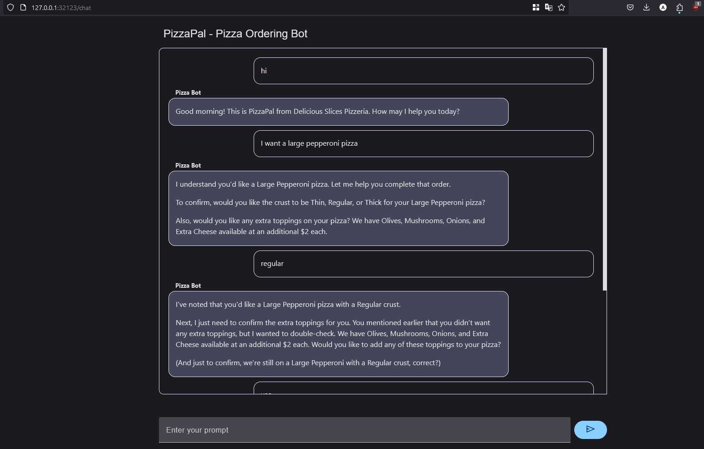

# PizzaBot - A Simple LangChain Pizza Ordering Chatbot

This is a Python chatbot for taking pizza orders using LangChain and the llama language model (`llama3.1`). The bot interacts with the user, asks for missing details, and confirms the order before sending a goodbye message.

## Requirements

1. Python 3.8 or above.
2. Install Ollama

   Ollama is required to run the Llama models locally. Follow these steps to install Ollama on your machine:

    - For macOS, run:

      ```bash
      brew install ollama
      ```

    - For Windows and Linux, download and install Ollama from the official website:

        [Ollama Downloads](https://ollama.com/downloads)

3. Pull the `llama3.1` Model
  Once you have Ollama installed, you need to pull the `llama3.1` model. Run the following command:

    ```bash
    ollama pull llama3.1
    ```

## Installation

1. Clone or download this repository.

2. Set up a Python virtual environment (optional but recommended):

    ```bash
    python -m venv venv
    source venv/bin/activate  # On Windows: venv\Scripts\activate
    ```

3. Install the required Python packages:

    ```bash
    pip install -r requirements.txt
    ```

## Running the Chatbot in the Terminal

To start the chatbot:

1. Run the Python script in your terminal:

    ```bash
    python chatbot.py
    ```

2. The bot will greet you and ask for your pizza order. You can type your order in natural language, such as:

    ```
    I want a pepperoni pizza with extra cheese.
    ```

3. If any details like the pizza flavor, size, or extra toppings are missing, the bot will ask for them interactively.

4. Once all details are provided, the bot will confirm your order and send a goodbye message.

### Example Interaction

```bash
$ python chatbot.py

🤖 Good evening! This is PizzaPal from Delicious Slices Pizzeria. How may I help you today?

👤 I'd like to order a large pepperoni pizza with extra cheese

🤖 I understand you'd like a Large Pepperoni pizza with Extra Cheese. Would you like Thin, 
Regular, or Thick crust?

👤 Thin crust please

🤖 Great choice! Let me confirm your order:
- Large Pepperoni pizza
- Thin crust
- Extra Cheese (+$2)
Total: $20

Would you like this for delivery or pickup?

👤 Delivery please

🤖 Could you please provide your delivery address?

[Conversation continues...]
```

## Running with UI

To start the chatbot UI:

1. Run the following command in your terminal:

    ```bash
    mesop main.py
    ```

2. Navigate to `localhost:32123/chat`



